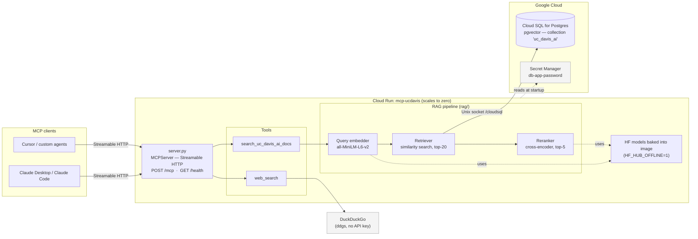
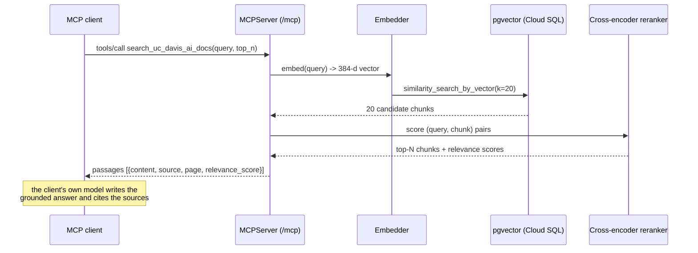
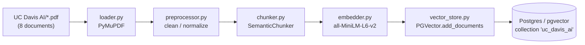

# UC Davis AI — MCP Server

**Live:** `https://mcp-ucdavis-949842158080.us-central1.run.app/mcp`
(Cloud Run, public, no auth · `/health` for a status check)

An [MCP](https://modelcontextprotocol.io) server that exposes two tools to any
MCP-capable AI application (Claude Desktop, Claude Code, Cursor, custom agents,
…):

| Tool | What it does |
|---|---|
| `search_uc_davis_ai_docs` | Semantic search (RAG retrieval) over UC Davis's official AI policy and guidance PDFs. Returns the most relevant passages with source document + page number. It does **not** write the answer — the calling model does, grounded on the passages. |
| `web_search` | DuckDuckGo web search (no API key). Returns title / URL / snippet rows. |

The RAG pipeline is ported from the sibling **UAC** project: PyMuPDF text
extraction → cleaning → `SemanticChunker` → HuggingFace embeddings
(`all-MiniLM-L6-v2`) → **Postgres / `pgvector`** → similarity search (top‑20) →
cross‑encoder rerank (`ms-marco-MiniLM-L-6-v2`, top‑5).

The 8 bundled source documents live in [`UC Davis AI/`](UC%20Davis%20AI/).

## System design

### Components



### A `search_uc_davis_ai_docs` call



### Ingestion (build the vector store — run once, offline)



Both HuggingFace models are baked into the Docker image at build time, so the
running container needs no network access to Hugging Face. The vector store
lives in Postgres (not a local file) so it survives redeploys and scale‑out,
and can be shared with the sibling **UAC** project (same collection name).

## Local development

```bash
uv sync
cp .env.example .env      # set DATABASE_URL to a local Postgres with `pgvector`
```

Your Postgres needs the extension: `CREATE EXTENSION IF NOT EXISTS vector;`

Build the vector store from the bundled PDFs (one time):

```bash
uv run python -m knowledge_base.build_index
```

Run the server:

```bash
uv run python server.py
# MCP endpoint:  http://127.0.0.1:8080/mcp
# Health check:  http://127.0.0.1:8080/health
```

### Connect an MCP client

Point any of these at the deployed endpoint
`https://mcp-ucdavis-949842158080.us-central1.run.app/mcp` (or your local
`http://127.0.0.1:8080/mcp`):

| Client | How |
|---|---|
| **Claude Code** | `claude mcp add --transport http ucdavis-ai https://mcp-ucdavis-949842158080.us-central1.run.app/mcp` (add `-s user` for all projects) |
| **Claude Desktop** | Settings → Connectors → Add custom connector → paste the `/mcp` URL. Older builds: add an `mcpServers` entry running `npx -y mcp-remote <url>`. |
| **Claude.ai** (Pro/Max/Team/Enterprise) | Settings → Connectors → Add custom connector → paste the `/mcp` URL, no auth. |
| **Anthropic API** | `mcp_servers=[{"type":"url","url":"<url>/mcp","name":"ucdavis-ai"}]` with the `mcp-client-2025-04-04` beta. |
| **ChatGPT** (Plus/Pro/Team/Enterprise) | Settings → Connectors → enable Developer mode → Create connector → paste the `/mcp` URL, auth None. Enable per-chat. |
| **OpenAI API** | `tools=[{"type":"mcp","server_label":"ucdavis_ai","server_url":"<url>/mcp","require_approval":"never"}]` (Responses API). |
| **MCP Inspector** | `npx @modelcontextprotocol/inspector` → connect to the `/mcp` URL. |

Quick scripted check:

```bash
uv run python -c "
import asyncio
from mcp.client.streamable_http import streamable_http_client
from mcp.client.session import ClientSession

async def main():
    async with streamable_http_client('http://127.0.0.1:8080/mcp') as s:
        async with ClientSession(s[0], s[1]) as sess:
            await sess.initialize()
            print([t.name for t in (await sess.list_tools()).tools])
            r = await sess.call_tool('search_uc_davis_ai_docs',
                                     {'query': 'What does the AI Council recommend?'})
            print(r.content[0].text[:500])
asyncio.run(main())
"
```

## Deployment

Runs on **Google Cloud Run** (`mcp-ucdavis`, project `uc-davis-ai-chatbot`,
`us-central1`), `--allow-unauthenticated`, reusing the **UAC** project's Cloud
SQL instance (`uac-db`) and its already-built `uc_davis_ai` pgvector
collection — no separate database, no re-ingestion.

Currently deployed manually:

```bash
gcloud run deploy mcp-ucdavis --source . --region=us-central1 \
  --allow-unauthenticated --memory=2Gi --cpu=2 --min-instances=0 --max-instances=3 --timeout=300 \
  --add-cloudsql-instances="uc-davis-ai-chatbot:us-central1:uac-db" \
  --set-env-vars="CLOUD_SQL_CONNECTION_NAME=uc-davis-ai-chatbot:us-central1:uac-db,DB_USER=uac-app,DB_NAME=uac,SEED_ON_STARTUP=true" \
  --set-secrets="DB_PASSWORD=db-app-password:latest"
```

`.github/workflows/deploy.yml` can take over push-to-deploy once Workload
Identity Federation is configured (uncomment its `push:` trigger). Full setup
and the teardown command are in [DEPLOYMENT.md](DEPLOYMENT.md).

## CI

`.github/workflows/ci.yml` runs on every push/PR:

| Job | What |
|---|---|
| **lint** | `ruff check` + `ruff format --check` (dev deps only — no torch). |
| **test** | `uv sync --frozen` then `pytest` on Python 3.11 and 3.12. Unit tests mock the embedder/retriever/reranker and the DuckDuckGo client — hermetic, ~10 s, no model download, no DB, no network. |
| **docker** | `docker build .`, boot the container, and smoke-test `GET /health` + MCP `initialize` / `tools/list` — guards the contract external clients depend on. |

```bash
uv sync                        # includes the dev group
uv run pytest                  # or: uv run ruff check .
```

No secrets are needed for CI. The **deploy** workflow needs the Workload
Identity Federation secrets/variables listed in [DEPLOYMENT.md](DEPLOYMENT.md) §6.

## Configuration

All settings (see [`core/config.py`](core/config.py)) are environment
variables, optionally from `.env`:

| Var | Default | Notes |
|---|---|---|
| `DATABASE_URL` | — | Full SQLAlchemy URL for local dev. |
| `CLOUD_SQL_CONNECTION_NAME` / `DB_USER` / `DB_PASSWORD` / `DB_NAME` | — | Used in prod instead of `DATABASE_URL` (Cloud SQL Unix socket). |
| `VECTOR_COLLECTION_NAME` | `uc_davis_ai` | Same as UAC's default, so you can point at UAC's DB and reuse its collection. |
| `SEED_ON_STARTUP` | `true` | Seed the collection at startup if empty. Set `false` in prod and seed explicitly. |
| `WEB_SEARCH_REGION` | `us-en` | DuckDuckGo region. |
| `RETRIEVAL_TOP_K` / `RERANK_TOP_N` | `20` / `5` | Retrieval and rerank sizes. |

## Project layout

```
server.py               MCP server + tool definitions + /health
tools/
  rag_tool.py            search_knowledge_base(): embed → retrieve → rerank
  web_search.py          web_search(): DuckDuckGo
rag/
  retriever.py           pgvector similarity search
  reranker.py            cross-encoder reranking
knowledge_base/          ingestion pipeline (loader → preprocess → chunk → embed → store)
  build_index.py         `python -m knowledge_base.build_index`
core/config.py           settings
db/session.py            SQLAlchemy engine (only used to check if the collection is seeded)
UC Davis AI/             the 8 bundled source PDFs
tests/                   hermetic unit + smoke tests (pytest)
.github/workflows/       ci.yml (lint/test/docker) · deploy.yml (Cloud Run)
```
